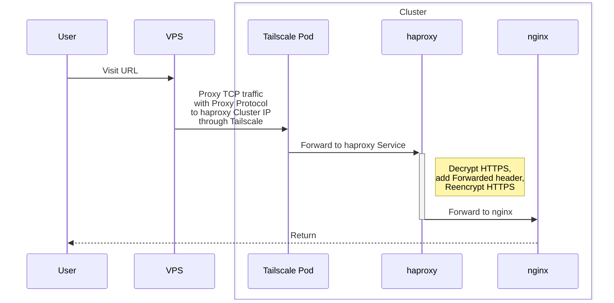

# External Proxy Ingress

Credit: https://github.com/JJGadgets/Biohazard/blob/0892c3da33f919cf6801430b17cd545a6a2cdf93/kube/deploy/core/ingress/external-proxy-x/README.md

## Diagram

## VPS haproxy configuration

See [config file applied with Ansible](/ansible/vps/roles/haproxy/templates/haproxy.cfg.j2)

## Advantages

- Hide home network IP
- No ports opened at home
- No dynamic DNS because of changing IP at home
